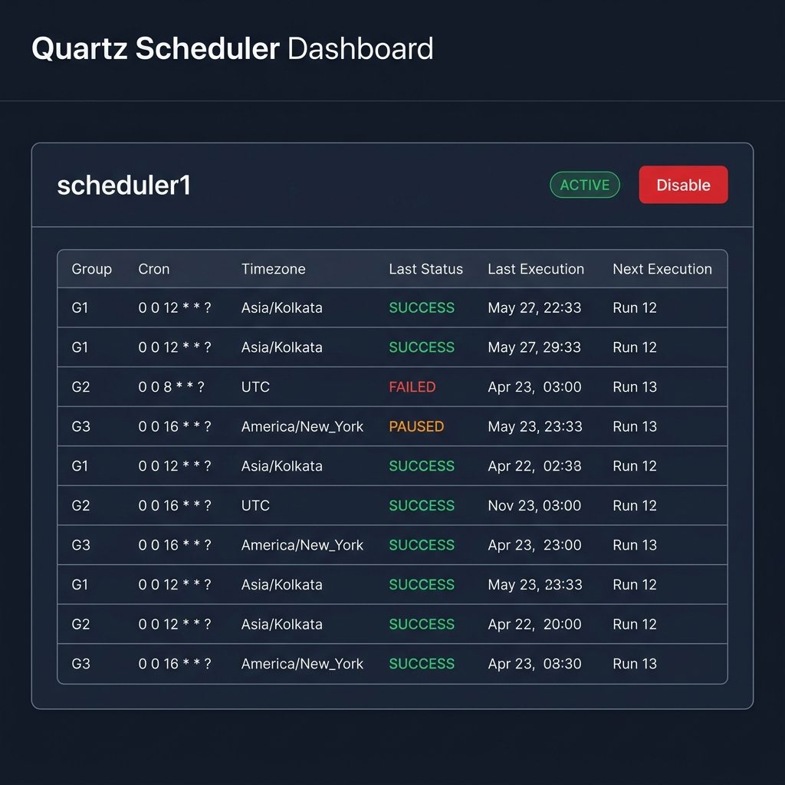

# Custom Scheduler Common Library: Complete Tutorial

Welcome to the **Custom Scheduler Common Library**! This powerful Spring Boot starter empowers you to build highly configurable, multi-timezone, and database-driven Quartz scheduling systems with zero boilerplate. 

Instead of hardcoding triggers in your code, this library uses a **Database Registry Workflow**, giving you total runtime control over your jobs and execution metrics.

---

## 1. Core Architecture

The library acts as a bridge between Spring Boot, JPA, and Quartz.
- **`custom_job_registry`**: Stores the metadata of your Spring beans (bean name, method name, parallelism flag).
- **`custom_trigger_registry`**: Stores the dynamic scheduling metadata (Cron expression, Timezone, Last Execution Status).
- **Embedded UI**: A zero-dependency dashboard for monitoring and toggling jobs on the fly.

When your application starts, the library scans for methods annotated with `@CustomScheduled`, automatically writes them to your database registry as `INACTIVE`, and waits for you to enable them!

---

## 2. Getting Started

### Step 2.1: Add the Dependency
First, build the `scheduler-common` jar locally (`mvn clean install`), and add it to your Spring Boot project:
```xml
<dependency>
    <groupId>com.common</groupId>
    <artifactId>scheduler-common</artifactId>
    <version>1.0.0-SNAPSHOT</version>
</dependency>
```

### Step 2.2: Enable the Scheduler
Add the `@EnableCustomScheduler` annotation to your main application class:
```java
@SpringBootApplication
@EnableCustomScheduler
public class MySaaSApplication {
    public static void main(String[] args) {
        SpringApplication.run(MySaaSApplication.class, args);
    }
}
```

---

## 3. Configuring Groups and Timezones

The magic of this library comes from its ability to route jobs to specific logical "Groups" (which represent countries, regions, or tenants).

Define your groups globally in your `application.properties`:
```properties
# standard MySQL setup
spring.datasource.url=jdbc:mysql://localhost:3306/mydb
spring.datasource.username=root
spring.datasource.password=root

# Define your groups
custom.scheduler.groups.INDIA_SHIFT.timezone=Asia/Kolkata
custom.scheduler.groups.INDIA_SHIFT.cron=0 0 9 * * ?

custom.scheduler.groups.US_SHIFT.timezone=America/New_York
custom.scheduler.groups.US_SHIFT.cron=0 30 15 * * ?
```
*Note: The `cron` attribute in the properties file is entirely optional. If you don't define it, the library will fallback to the cron defined directly on your method annotation.*

---

## 4. Writing Your First Job

To schedule a job, simply create a Spring `@Service` and annotate a method with `@CustomScheduled`. You can choose exactly which groups this job should run for using the `allowedGroups` parameter!

```java
import com.common.scheduler.annotation.CustomScheduled;
import org.springframework.stereotype.Service;
import java.time.LocalDateTime;

@Service
public class ReportService {

    @CustomScheduled(
        jobName = "dailyReportJob",
        allowedGroups = {"INDIA_SHIFT", "US_SHIFT"}, // Runs in India at 9 AM, and US at 3:30 PM!
        cron = "0 0 0 * * ?", // This acts as a fallback if the group doesn't specify a cron
        parallelism = false
    )
    public void generateReports() {
        System.out.println("Generating reports at: " + LocalDateTime.now());
    }
}
```

### Understanding Parallelism
- **`parallelism = false` (Default)**: Guarantees that this job runs strictly one-at-a-time across your entire cluster. If the India shift and US shift somehow overlap, one will wait for the other.
- **`parallelism = true`**: Allows the method to run concurrently. If 5 nodes pick up the triggers, they will all execute simultaneously.

---

## 5. Activating Your Jobs

When you start your application, the library will automatically generate the required Quartz tables and custom registry tables.
However, **all jobs are inserted as `INACTIVE` by default**. This prevents massive job storms during a fresh deployment.

To start the jobs, simply update their status in the database to `ACTIVE`:
```sql
UPDATE custom_job_registry SET status = 'ACTIVE';
```

For the Quartz engine to instantly pick up this database change, trigger the synchronization service:
```java
@Autowired
private DatabaseSchedulerSyncService syncService;

// Call this from a REST endpoint after updating statuses
syncService.syncDatabaseJobsWithQuartz();
```

---

## 6. Using the Embedded UI Dashboard

Don't want to write SQL to activate jobs? The library ships with a beautiful, zero-dependency embedded HTML dashboard!

Enable it in your properties:
```properties
custom.scheduler.ui.enabled=true
```

Then visit:
👉 **`http://localhost:8080/custom-scheduler/ui`**



From this dashboard, you can:
- See all configured jobs, their targeted groups, and crons.
- View real-time execution metrics (`last_execution_date`, `last_execution_status`).
- See exactly when the `next_execution_date` will occur in the server's time.
- Click the **Enable/Disable** buttons to instantly toggle jobs. The UI automatically triggers the synchronization service for you!

---

## 7. Advanced Scenarios

### Scenario A: Same Cron, Different Timezones
Simply define the `cron` in your annotation, and only define timezones in your properties:
```properties
custom.scheduler.groups.UK.timezone=Europe/London
custom.scheduler.groups.NY.timezone=America/New_York
```
```java
@CustomScheduled(jobName = "syncJob", cron = "0 0 12 * * ?", allowedGroups = {"UK", "NY"})
public void runAtNoonLocalTime() { ... }
```
*Result: The job runs at 12 PM in London, and then hours later at 12 PM in New York.*

### Scenario B: Different Crons, Same Timezone
Define the crons strictly in your properties:
```properties
custom.scheduler.groups.MORNING.timezone=Asia/Kolkata
custom.scheduler.groups.MORNING.cron=0 0 9 * * ?

custom.scheduler.groups.NIGHT.timezone=Asia/Kolkata
custom.scheduler.groups.NIGHT.cron=0 0 21 * * ?
```
```java
@CustomScheduled(jobName = "shiftJob", allowedGroups = {"MORNING", "NIGHT"})
public void runForShifts() { ... }
```
*Result: The job runs at 9 AM and 9 PM IST seamlessly!*

---

## 8. Under the Hood: Key Spring Features Used

If you want to understand how the `scheduler-common` jar is implemented under the hood, here are the core Spring Framework concepts used to build it:

1. **Spring Boot Auto-Configuration (`spring.factories` or `.imports`)**
   The library uses auto-configuration to automatically load the JPA Repositories, Entity scans, and Services into the host application context without requiring the developer to manually define `@ComponentScan`.

2. **Bean Post Processors (`BeanPostProcessor`)**
   The core magic of scanning for `@CustomScheduled` happens during the application context startup. By implementing `BeanPostProcessor`, the library inspects every Spring bean as it is created, uses Java Reflection to find methods with the annotation, and inserts them into the database registry *before* the application fully starts.

3. **Spring Application Events (`@EventListener(ApplicationReadyEvent.class)`)**
   The library needs to guarantee that all beans are fully initialized and the database registry is populated before syncing with Quartz. Listening to the `ApplicationReadyEvent` ensures the sync process happens safely at the very end of the boot sequence.

4. **Spring Reflection (`ReflectionUtils`)**
   Because Quartz executes jobs outside of the standard Spring MVC request thread, the custom Quartz jobs (`ConcurrentMethodInvokingQuartzJob`) use Spring's `ApplicationContext` to look up the target bean by name, and use `ReflectionUtils` to dynamically invoke the scheduled method.

5. **Conditional Beans (`@ConditionalOnProperty`)**
   The embedded HTML dashboard controller is heavily gated using conditional annotations. This ensures that the REST endpoints and HTML payloads are completely absent from the Spring context unless the developer explicitly turns them on in their properties file.
